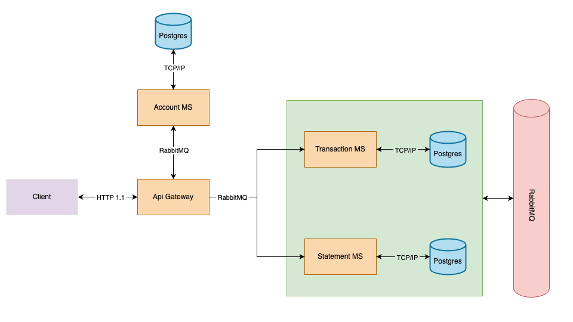
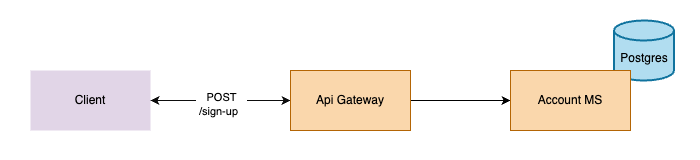
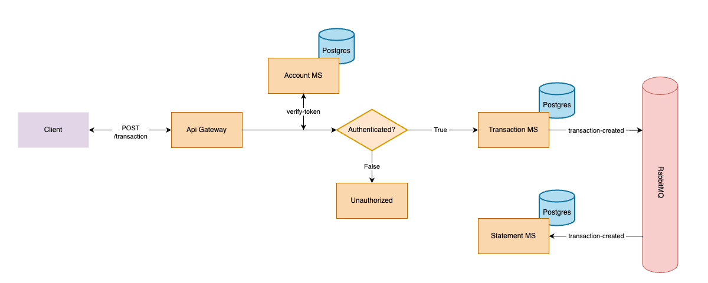
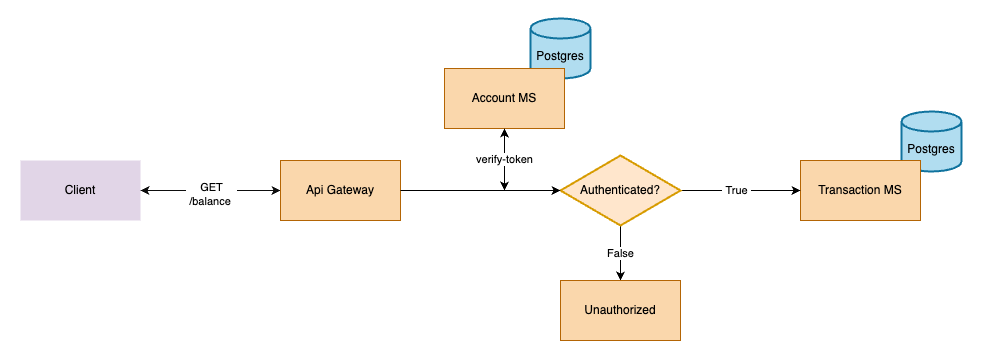
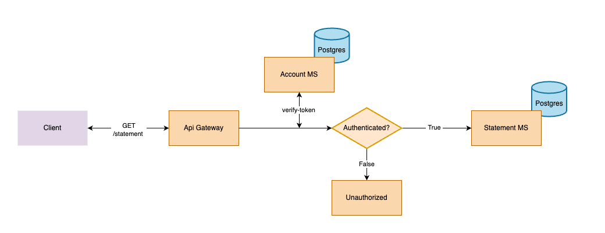

## Summary
1. [Project](#project)
2. [Technologies](#technologies)
3. [Getting started](#getting-started)
4. [Tests](#tests)
5. [API Documentation](#api-documentation)
6. [Architecture](#architecture)
    - [Create Account](#create-account)
    - [Authenticate Account](#authenticate-account)
    - [Create Transaction](#create-transaction)
    - [Get Balance](#get-balance)
    - [Get Statement](#get-statement)

## Project

Welcome to the Digital Wallet project repository, a microservices-based solution for managing financial transactions. This project provides an application where users can perform operations such as deposits, withdrawals, purchases, cancellations, and reversals, as well as view a detailed statement of these transactions.

The project consists of four main components:
  1. **Api Gateway** - Responsible for managing communication between the microservices listed below;

  2. **Account MS** - Handles account creation and authentication;

  3. **Transaction MS** - Processes all account transactions;

  4. **Statement MS** - Stores statements after each transaction and provides a history;

## Technologies

This project was developed using the following technologies:

* **Backend**: Developed with [NestJS](https://nestjs.com/) using [TypeScript](https://www.typescriptlang.org/) for a modular and maintainable codebase;

* **Database**: Utilizes [PostgreSQL](https://www.postgresql.org/) with [Prisma](https://www.prisma.io/) ORM for efficient and type-safe database interactions;

* **Messaging**: [RabbitMQ](https://www.rabbitmq.com/) for inter-microservice communication;

* **Authentication**: [JWT](https://www.npmjs.com/package/jsonwebtoken) (JSON Web Tokens);

* **Containerization**: [Docker](https://www.docker.com/) is employed to containerize services;

* **Testing**: [Jest](https://jestjs.io/pt-BR/) and [@faker-js/faker](https://www.npmjs.com/package/@faker-js/faker), used for mocking;

* **Documentation**: [Swagger](https://swagger.io/)

## Getting started
  1. If you don't have [docker](https://www.docker.com/), install it on your machine.

  2. Clone this project and access the folder<br>
  ```bash
    # To clone with ssh
    $ git clone git@github.com:PabloRSantos/wallet.git

    # To clone with https
    $ git clone https://github.com/PabloRSantos/wallet.git

    $ cd wallet
  ```

  3. Fill all `.env` according to `.env.example`<br>
  ```bash
    $ cp .env.example .env
    $ cp ./api-gateway/.env.example ./api-gateway/.env
    $ cp ./account-ms/.env.example ./account-ms/.env
    $ cp ./transaction-ms/.env.example ./transaction-ms/.env
    $ cp ./statement-ms/.env.example ./statement-ms/.env
  ```

  4. Run docker containers<br>
  ```bash
    # To run all containers together
    $ docker-compose up

    # To run each container individually
    $ docker-compose up -d database
    $ docker-compose up -d rabbitmq
    $ docker-compose up -d account-ms
    $ docker-compose up -d statement-ms
    $ docker-compose up -d transaction-ms
    $ docker-compose up -d api-gateway
  ```

## Tests
  
  All microservices have unit tests. To run it:
  ```bash
    # Access a microsservice (account-ms, transaction-ms or statement-ms)
    $ cd account-ms

    # To run tests
    $ npm run test

    # To run tests and watch changes
    $ npm run test:watch

    # To run tests and generate coverage report
    $ npm run test:cov 
  ```

## API Documentation
  The project uses swagger to document all possible resources. To access it:

  1. Run api gateway
  ```bash
    $ docker-compose up -d api-gateway
  ```

  2. Access `localhost:3000/docs`

## Architecture
The architecture is based on microservices, ensuring modularity, scalability and maintainability. Here are the key components:

* **API Gateway**: Acts as the entry point for client requests, routing them to the appropriate microservice via RabbitMQ events.

* **Data Persistence**: We have three separate PostgreSQL databases, one for each microservice, following the [database per service](https://microservices.io/patterns/data/database-per-service.html) pattern.

* **Inter-Service Communication**: RabbitMQ is used for reliable and efficient communication between microservices.

* **CQRS**: In order to relieve transaction-ms, statement-ms was implemented, which has the function of taking care of the statement part of an account, leaving transaction-ms free to just process transactions. [See more here](https://microservices.io/patterns/data/cqrs.html)



### Create Account
To create an account, the client needs to provide a valid CPF, name, and a strong password. The client sends a request to the API Gateway, which then sends an event to the Account Microservice (AccountMS). The AccountMS validates whether the account already exists. If it does, an error is returned. If not, the account is created and the details are returned to the client.



### Authenticate Account
To authenticate an account, the client needs to provide the CPF and password created during the [Create Account](#create-account) process. The client sends a request to the API Gateway, which forwards the event to the Account Microservice (AccountMS). The AccountMS validates the CPF and password. If either is incorrect, a generic error message is returned. Otherwise, a JWT token for the account is generated and returned to the client.


### Create Transaction
To create a transaction, we will need:
* The **id** of transaction, represented in UUID to avoid duplications;
* The **operation** of transaction, which can be: `DEPOSIT`, `WITHDRAWAL`, `PURCHASE`, `CANCELLATION`, `REVERSAL`
* The **amount** of transaction
* The **parentId** of transaction, necessary for `REVERSAL` or `CANCELLATION` operations to reference the original transaction.

From that, the client sends a request to the API Gateway, which first verifies if the account is authenticated. If not, an Unauthorized error is returned. If authenticated, the request is forwarded to the Transaction Microservice (TransactionMS). The TransactionMS validates and processes the transaction.

Upon successful transaction creation, the TransactionMS emits a `transaction-created` event, necessary for Statement Microservice (StatementMS) update the transactions history.



### Get Balance

To retrieve the account balance, the client sends a request to the API Gateway, which first checks if the account is authenticated. If not, an Unauthorized error is returned. If authenticated, the request is forwarded to the Transaction Microservice (TransactionMS), which returns the current acount balance.



### Get Statement

To retrieve the account statement, you can apply the following optional filters:
* **page** and **perPage**: controls pagination.
* **periodStart** and **periodEnd**: controls the period for the statements.
* **operation**: filter the statements by specific operation type.

From that, the client sends a request to the API Gateway, which first checks if the account is authenticated. If not, an Unauthorized error is returned. If authenticated, the request is forwarded to the Statement Microservice (StatementMS), which processes the request and returns the results based on the provided filters.




